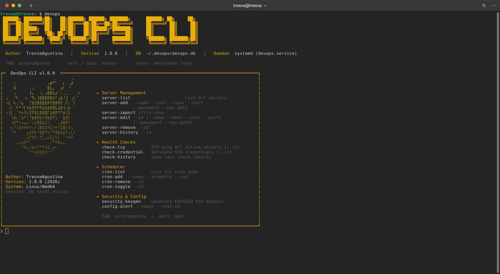

# 🚀 DevOps CLI Agent (Infra Portal)


A powerful, standalone, and highly interactive Command-Line Interface (CLI) built with Go. This tool acts as a unified "worker agent" and control center for System Administrators and DevOps Engineers to manage servers, perform health checks, automate `rsync` backups, and run background cronjobs—all strictly from the terminal.

## 🎯 Purpose
Managing multiple servers, credentials, and cronjobs manually can be error-prone. This tool aims to centralize **Infrastructure Monitoring** and **Routine Automation** into a single binary. 

Rather than modifying the host OS's `crontab` or scattering bash scripts, this CLI comes with an embedded SQLite database and a native Go Daemon engine to manage its own background tasks, ensuring maximum portability and security.

## 🛠️ Tech Stack
- **Language**: Go (Golang)
- **CLI Framework**: [Cobra](https://github.com/spf13/cobra)
- **UI / Terminal Styling**: [Pterm](https://github.com/pterm/pterm) (Minimalist Gold/Black Hermes aesthetic)
- **Interactive REPL**: [go-prompt](https://github.com/c-bata/go-prompt) (Auto-completion, Raw Mode handling)
- **Database**: Embedded SQLite3 via [GORM](https://gorm.io/)
- **Job Scheduler**: [robfig/cron/v3](https://github.com/robfig/cron)
- **Sync Engine**: Native OS `rsync` wrapped via Go `os/exec`

## ✨ Key Features

1. **Interactive REPL Shell**: Highly responsive terminal interface with TAB-autocompletion. Press `devops` to enter the shell. Native word-deletion (Alt+Backspace / Ctrl+W) and escape sequence swallowing supported.
2. **Server & Credential Management (CRUD)**: Store server IPs, SSH ports, and credentials securely in an embedded SQLite DB (`~/.devops/devops.db`).
3. **Advanced Health Checks**: 
   - TCP Ping checks to ensure server uptime.
   - Deep SSH Auth checks (`check-credential`) to validate all stored credentials programmatically.
4. **Daemon Engine (Cron)**: Built-in scheduler. Add background jobs without touching the host's `crontab`.
5. **Smart Auto-Backups**: 
   - Wrap `rsync` commands safely.
   - Backups are automatically grouped into directories by Server Name.
   - Built-in `--user` and `IdentitiesOnly=yes` injection to prevent SSH authentication spam.
6. **Telegram Integration**: Send alerts and health-check summaries directly to a Telegram Group.
7. **Security Setup**: Built-in Ed25519 SSH Keypair generator (`security-keygen`) strictly isolated for the agent.

---

## 📦 Installation & Setup

Since this tool is built in Go, it compiles into a **single, standalone binary**. No external dependencies (like Node.js, Python, or MySQL) are required.

### 1. Build the Binary
```bash
git clone <your-repo-url>
cd devops-cli
go build -o devops .
```

### 2. Deploy (Example)
We provide a `deploy.sh.example` script if you wish to push this binary to a remote Linux worker node (e.g., an Office PC acting as the central agent).
```bash
cp deploy.sh.example deploy.sh
# Edit deploy.sh with your server IP and SSH keys
./deploy.sh
```

### 3. First-Time Security Setup
Run the CLI:
```bash
devops
```
Inside the interactive prompt, generate the Agent's SSH Key:
```bash
❯ security-keygen
```
*Copy the green Public Key text and paste it into `~/.ssh/authorized_keys` on your target servers for a dedicated user (e.g. `bizops-agent`).*

---

## 🚀 How to Run

### Interactive Mode
Simply run the binary without arguments to enter the Interactive Shell:
```bash
./devops
```
Inside the shell, you can type `help` to see all commands:
- `server-list` / `server-add`
- `cred-list` / `cred-add`
- `backup-create` / `backup-restore`
- `cron-list` / `cron-add`

### Daemon Mode (Background Worker)
To run the cronjobs and automated backups continuously in the background, run:
```bash
./devops daemon
```
*Best practice: Run this command via a Systemd service (e.g. `devops.service`).*

### Telegram Setup
To receive alerts for failing health checks:
```bash
❯ config-alert
# Follow the prompt to enter your Bot Token and Chat ID
❯ test-alert
```

---
